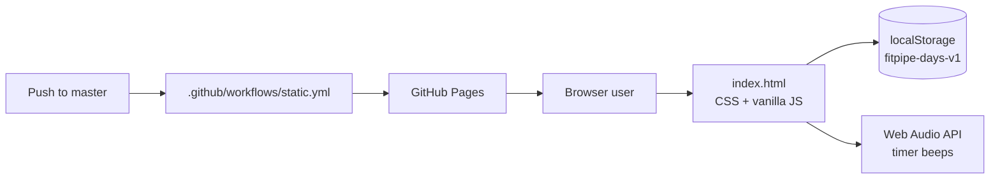

# AI Project Context Report

> Generated by an AI agent during onboarding (see PROJECT_ONBOARDING_PROMPT.md). Facts vs assumptions are labeled. Important claims include evidence citations.

**Generated:** 2026-07-29
**Agent / Tool:** Cursor Auto (Composer)
**Repository:** `/home/lenovvo/Documents/fat-loss-pipeline` (`git@github.com:himanshuramavat/fat-loss-pipeline.git`)
**Analysis scope:** `master` @ `b869e8bdf771b3e188bcbc9471bb43119449e80a`

---

## Project Overview

### What This Project Is

**fat-loss-pipeline** is a single-page static web app that presents a personal 28-day fat-loss / body-recomposition plan using a CI/CD “deployment pipeline” metaphor (builds, streaks, passing/shipped status). Progress is tracked client-side via `localStorage`. The app is deployed to GitHub Pages with a GitHub Actions workflow.

### Key Facts

- [Fact] The only application source file is `index.html` (single HTML + CSS + JS file, ~670 lines). — Evidence: `index.html`; `git show 29f2ee4 --stat` (670 lines added)
- [Fact] There is no package manager, framework, or backend: no `package.json`, `composer.json`, `requirements.txt`, or server code. — Evidence: repository root listing; glob of tracked/untracked project files
- [Fact] Deploy is GitHub Pages via Actions on push to `master` or `workflow_dispatch`. — Evidence: `.github/workflows/static.yml` (lines 1–43)
- [Fact] Live site: https://himanshuramavat.github.io/fat-loss-pipeline/ — Evidence: owner confirmation 2026-07-29
- [Fact] Progress persists under `localStorage` key `fitpipe-days-v1`. — Evidence: `index.html` (lines 380, 496–512)
- [Fact] The plan covers 28 days with week 1–2 and week 3–4 patterns (circuit / walk / rest), plus desk tips, nutrition rules, walk timer, and schedule panels. — Evidence: `index.html` (lines 243–373, 383–409)
- [Fact] Git history on `master` started 2026-07-29 with the HTML app and Pages workflow. — Evidence: `git log --oneline`
- [Fact] AI onboarding kit and generated memory artifacts are intended to be committed (not gitignored). — Evidence: owner confirmation 2026-07-29

### Assumptions

- [Assumption] Primary user is the repo owner (personal tracker), not a multi-tenant product. — Rationale: terminal label `himanshu / fat-loss-pipeline`, India-oriented nutrition/snack copy, fixed personal schedule times; no accounts or multi-user features.
- [Assumption] Onboarding docs (`PROJECT_ONBOARDING_PROMPT.md`, `DAILY_OPS.md`, `prompts/`, `templates/`, `examples/`, AI memory files) are tooling for agents, not part of the fitness UI product surface. — Rationale: content is tool-agnostic onboarding; they will still be publicly reachable via Pages because deploy uploads `.`.

---

## Architecture Summary

### System Diagram



### Module Map

| Module | Path | Responsibility | Evidence |
| ------ | ---- | -------------- | -------- |
| UI shell + styles | `index.html` (CSS in `<style>`) | Dark “terminal” theme, tabs, cards, timer layout | `index.html` lines 7–222 |
| Day plan engine | `index.html` script | Build 28 days, task lists by type/week | lines 383–409 |
| Progress UI + persistence | `index.html` script | Render checkboxes, streak/progress, save/load | lines 412–535 |
| Walk timer | `index.html` script | 30/40 min phased timer + beep | lines 537–667 |
| Static content panels | `index.html` HTML | Desk mode, nutrition, schedule | lines 255–373 |
| CI deploy | `.github/workflows/static.yml` | Upload repo root to GitHub Pages | entire workflow file |
| AI onboarding kit | `PROJECT_ONBOARDING_PROMPT.md`, `DAILY_OPS.md`, `prompts/`, `templates/`, `examples/`, `AI_PROJECT_*.md` | Agent workflows / project memory | owner: commit required files, do not gitignore |

### Data Flow

1. On load, `loadState()` reads JSON from `localStorage` into `state`.
2. `buildDays()` / `ALL_DAYS` define the 28-day plan; `renderAll()` paints week panels and binds checkboxes.
3. Checkbox changes update `state[day][idx]`, call `saveState()`, then re-render.
4. Header badges derive completed days, streak, and progress % from `state` vs `ALL_DAYS`.
5. Walk timer is in-memory only (not persisted); phase transitions call `beep()` via Web Audio API.

---

## Technology Stack

| Category | Technology | Version (if known) | Evidence |
| -------- | ---------- | ------------------ | -------- |
| Language | HTML5, CSS3, vanilla JavaScript | Browser ES features (`async`/`await`, `padStart`, CSS variables) | `index.html` |
| Framework | None | — | No framework imports or build config |
| Fonts | Google Fonts: Inter, JetBrains Mono | CDN `@import` | `index.html` line 8 |
| Persistence | `window.localStorage` | Key `fitpipe-days-v1` | lines 380, 496–512 |
| Audio | Web Audio API (`AudioContext`) | — | lines 591–601 |
| Database | None | — | No DB client or API |
| Auth | None | — | No login/session code |
| Testing | None discovered | — | No test files or runners |
| Package manager | None | — | No lockfiles / manifests |
| CI/CD | GitHub Actions → GitHub Pages | `actions/checkout@v4`, `configure-pages@v5`, `upload-pages-artifact@v3`, `deploy-pages@v5` | `.github/workflows/static.yml` |
| Hosting | GitHub Pages | https://himanshuramavat.github.io/fat-loss-pipeline/ | owner confirmation; `.github/workflows/static.yml` |

---

## Major Features

| Feature | Description | Key files | Status |
| ------- | ----------- | --------- | ------ |
| 28-day checklist | Days 1–28 with circuit/walk/rest tasks; weeks 1–2 vs 3–4 differ (walk length, circuit rounds, day pattern) | `index.html` 383–440 | Shipped in initial commit |
| Progress header | Build number, status badge, streak, progress bar | `index.html` 232–241, 462–494 | Shipped |
| Desk mode | Desk-job movement / posture / snack guidance | `index.html` 255–276 | Shipped (static) |
| Nutrition panel | Keep/cut/reduce rules (protein, sugar, fried, maida, water) | `index.html` 278–285 | Shipped (static) |
| Walk timer | 30 or 40 min; warm-up / brisk / cool-down phases; start/pause/reset; beep on phase change | `index.html` 287–315, 537–667 | Shipped |
| Schedule | Weekly circuit vs walk table + daily timelines | `index.html` 317–373 | Shipped (static) |
| Reset progress | Confirm then clear all day state | `index.html` 375, 524–530 | Shipped |
| Pages deploy | Auto-deploy static content from repo root | `.github/workflows/static.yml` | Shipped |

---

## Development History

### Recent Timeline

| Date / Range | Change | Type | Evidence |
| ------------ | ------ | ---- | -------- |
| 2026-07-29 | Initial single-file fitness pipeline UI + client logic | Feature | `29f2ee4` — “Add initial HTML structure for fitness pipeline” |
| 2026-07-29 | GitHub Actions workflow for GitHub Pages | Infra / deploy | `b869e8b` — “Add GitHub Actions workflow for static site deployment” |
| 2026-07-29 | AI onboarding kit + context/memory artifacts added for agent workflows | Docs / tooling | `AI_PROJECT_*.md`, `DAILY_OPS.md`, `PROJECT_ONBOARDING_PROMPT.md`, `examples/`, `prompts/`, `templates/` |

### Patterns Observed

- Greenfield personal tool: two commits, no branches besides `master`, no tags/releases/changelog.
- Prefer zero-build static delivery (edit HTML → push → Pages).
- Product UX metaphors borrow from CI (build #, passing/shipped, pipeline name).

---

## Current Work In Progress

| Item | Location | Signal | Priority |
| ---- | -------- | ------ | -------- |
| No application TODO/FIXME in product code | `index.html` | Grep of product files found no WIP markers (only example/prompt docs) | — |
| No automated tests | repo | No test harness | Medium (quality) |
| No README / PROJECT_CONTEXT | repo root | Missing human-maintained product docs | Medium (docs) |
| Streak semantics undecided | `updateHeader` in `index.html` | Owner has no preference; keep current plan-day logic until a product decision | Low |

There is no evidence of incomplete product features (feature flags, disabled modules, or skipped tests) in `index.html`.

---

## Engineering Conventions

### Naming

- CSS: kebab-case classes (`.day-card`, `.timer-btn`, `.badge.pass`). — Evidence: `index.html` styles
- JS: camelCase functions/vars (`buildDays`, `totalMinutes`); SCREAMING_SNAKE for constants (`STORAGE_KEY`, `ALL_DAYS`). — Evidence: lines 380–410
- Data attributes: `data-panel`, `data-day`, `data-idx`, `data-mins`. — Evidence: HTML + listeners
- Storage key versioned with `-v1` suffix (`fitpipe-days-v1`). — Evidence: line 380

### Code Patterns

- Single-file architecture: markup, CSS, and JS colocated; no modules/bundler.
- State is a plain object keyed by day id → task index → boolean; render is full panel re-`innerHTML` then re-attach listeners. — Evidence: lines 412–459
- Async wrappers on sync `localStorage` I/O (`loadState` / `saveState`) without true asynchrony. — Evidence: lines 496–512
- Errors on load/save: load resets to `{}`; save `console.error`s. — Evidence: lines 496–512
- Timer phases built procedurally from duration (`buildPhases`). — Evidence: lines 545–554

### Testing

- [Fact] No unit, integration, or e2e tests exist in the repository.
- Manual verification: open `index.html` locally or via Pages; check checkboxes, refresh for persistence, exercise walk timer.

### Error Handling and Logging

- `localStorage` parse/set guarded with try/catch.
- `beep()` swallows AudioContext failures silently (`catch(e){}`). — Evidence: lines 591–601
- Reset uses `confirm()` before destructive clear.

### Formatting / Lint

- No ESLint, Prettier, or HTML linter config found.
- Style is compact/minified-leaning CSS (few spaces after `{`), readable JS with modest formatting.

---

## Technical Debt

| Item | Location | Impact | Suggested action |
| ---- | -------- | ------ | ---------------- |
| Monolithic `index.html` | `index.html` | Harder to review/test as features grow | Split CSS/JS only if product grows |
| Full re-render + listener rebind on every checkbox | `renderAll` / `attachCheckboxListeners` | Unnecessary DOM churn; possible focus quirks | Incremental update if UX issues appear |
| Deploy uploads entire repository (`.`) | `static.yml` line 40 | Onboarding docs / templates would publish to Pages if committed | Narrow `path` to site assets or add a `docs`/public filter |
| Storage schema has no migration story beyond key name | `STORAGE_KEY` | Changing task lists can desync old checkbox indices | Bump key version when task shape changes |
| Streak logic is sequential from day 1, not calendar-based | `updateHeader` lines 462–478 | Current behavior is plan-day streak; owner undecided on intent — do not “fix” without a clear product request | Leave as-is; document only |
| No tests / README | repo | Regression risk on timer and persistence | Add README + minimal manual checklist at minimum |

---

## Known Risks

### High-Risk Change Zones

| Zone | Why risky | Required verification |
| ---- | --------- | ---------------------- |
| `STORAGE_KEY` / `state` shape / `tasksFor` task order | Existing users’ checkbox progress maps by index; reordering tasks corrupts meaning | Manually migrate or bump storage key; test load of old JSON |
| `week12Pattern` / `week34Pattern` / `buildDays` | Changes rewrite the 28-day program semantics | Diff day types for all 28 days; update schedule panel copy to match |
| Walk timer phase math (`buildPhases`, `tick`) | Off-by-one or interval bugs break workouts mid-session | Run 30 and 40 min paths; verify phase lengths sum to total; pause/resume/reset |
| `resetBtn` / `saveState` | Data loss | Confirm dialog still present; verify empty state after reset + reload |
| `.github/workflows/static.yml` | Breaks production deploy; path `.` may expose unintended files | Dry-run Actions; confirm Pages artifact contents |
| Inline HTML via string templates in `renderPanel` | Task strings are currently static; future user-sourced text would be XSS-sensitive | Keep tasks trusted/static or escape if ever dynamic |

---

## Recommended Development Workflow

### Safe Change Process

1. Read `AI_PROJECT_MEMORY.md` (and this report for deep context).
2. For non-trivial work, follow `DAILY_OPS.md` / `prompts/START_TASK.md` (plan → approval → implement).
3. Edit `index.html` (and workflow only if deploy changes); avoid unrelated churn.
4. Verify locally in a browser (progress + timer + refresh persistence).
5. Push to `master` only when ready to deploy (workflow deploys on every `master` push), or use a branch/PR first.

### Commands

```bash
# Install
# None — no dependencies

# Develop (pick one)
xdg-open index.html
# or: python3 -m http.server 8080   # then open http://localhost:8080/

# Test
# No automated suite — manual browser checks

# Lint
# None configured
```

### Before Merging

- [ ] Checkbox progress still saves and reloads (`fitpipe-days-v1`)
- [ ] Week 1–2 and 3–4 day types match the Schedule panel
- [ ] Walk timer 30/40 min phase lengths and beeps behave correctly
- [ ] Reset still confirms and clears state
- [ ] If changing deploy path, confirm Pages artifact does not publish secrets or unwanted docs
- [ ] No unrelated files changed

---

## Uncertainties

| # | Uncertainty | Missing evidence | Suggested resolution |
| - | ----------- | ---------------- | -------------------- |
| 1 | ~~Pages URL / enabled~~ **Resolved** | — | Live at https://himanshuramavat.github.io/fat-loss-pipeline/ |
| 2 | ~~Commit vs gitignore onboarding kit~~ **Resolved** | — | Commit required onboarding/memory files; do **not** gitignore |
| 3 | Ideal streak semantics (plan-day vs calendar) | Owner has no preference yet | Keep existing `updateHeader` behavior; only change if explicitly requested |

---

## Context Sources Consulted

| Priority | File | Summary |
| -------- | ---- | ------- |
| 1 | `PROJECT_ONBOARDING_PROMPT.md` | Universal onboarding process (this run) |
| 2 | `DAILY_OPS.md` | Daily agent prompt routing after onboarding |
| 3 | `templates/AI_PROJECT_*.md.template` | Required structure for these artifacts |
| 4 | `index.html` | Entire application |
| 5 | `.github/workflows/static.yml` | Deploy pipeline |
| 6 | `git log` / `git status` / remote | History, WIP, origin |
| 7 | `prompts/*`, `examples/*` | Process examples only (not product truth) |

**Missing / not present:** `README.md`, `CLAUDE.md`, `AGENTS.md`, `PROJECT_CONTEXT.md`, `ARCHITECTURE.md`, `docs/`, `.cursor/rules/`, `.env.example`, Docker/k8s, changelog, tags.
