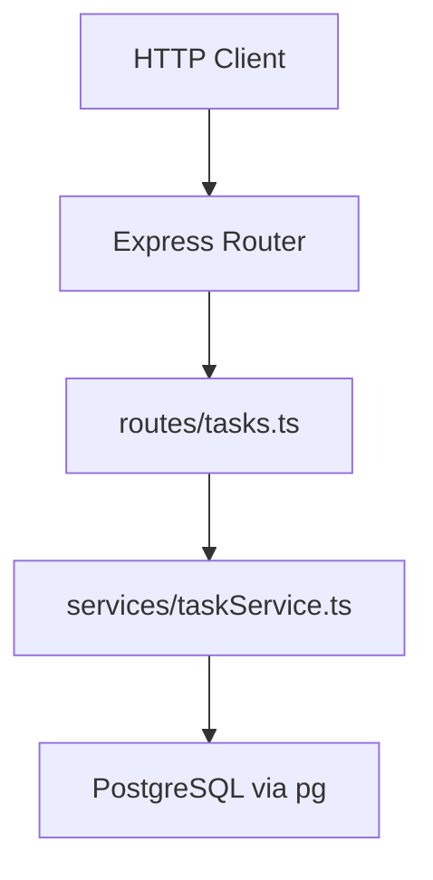

# Example: Universal Small Project

This example shows how an AI agent might fill onboarding outputs for a fictional **Task API** — a small Node.js REST service. It demonstrates evidence citation, fact vs assumption labeling, and the expected depth for v1.

---

## Fictional Project Snapshot

```text
task-api/
├── README.md
├── package.json
├── src/
│   ├── index.ts
│   ├── routes/tasks.ts
│   ├── services/taskService.ts
│   └── db/client.ts
├── tests/
│   └── tasks.test.ts
└── .github/workflows/ci.yml
```

---

## Sample: AI_PROJECT_CONTEXT_REPORT.md (excerpt)

### Project Overview

**What This Project Is**

Task API is a lightweight REST service for managing todo items. It exposes CRUD endpoints backed by PostgreSQL.

**Key Facts**

- [Fact] Runtime is Node.js with TypeScript. — Evidence: `package.json` (`"typescript": "^5.4.0"`, `"main": "dist/index.js"`)
- [Fact] Uses Express for HTTP routing. — Evidence: `package.json` dependency `"express": "^4.18.0"`, `src/index.ts` imports `express`
- [Fact] PostgreSQL via `pg` driver. — Evidence: `package.json` dependency `"pg"`, `src/db/client.ts`
- [Fact] CI runs tests on push to `main`. — Evidence: `.github/workflows/ci.yml` (`on: push`, `npm test`)

**Assumptions**

- [Assumption] No authentication is implemented yet; all endpoints are public.
  Rationale: No auth middleware found in `src/index.ts` or routes; README does not mention auth. Needs confirmation before production deployment.

### Architecture Summary



| Module | Path | Responsibility |
| ------ | ---- | -------------- |
| Entry | `src/index.ts` | Bootstraps Express, mounts routes |
| Routes | `src/routes/tasks.ts` | HTTP handlers for `/tasks` |
| Service | `src/services/taskService.ts` | Business logic, validation |
| DB | `src/db/client.ts` | Connection pool |

### Development History (recent)

| Date | Change | Evidence |
| ---- | ------ | -------- |
| 2026-06-10 | Added pagination to GET /tasks | Commit `a1b2c3d` |
| 2026-06-05 | Fixed N+1 query in task list | Commit `d4e5f6g`, message references issue #42 |
| 2026-05-28 | Initial project scaffold | Commit `h7i8j9k` |

### Current Work In Progress

| Item | Location | Signal |
| ---- | -------- | ------ |
| Bulk delete endpoint | `src/routes/tasks.ts:87` | `// TODO: implement bulk delete` |
| Rate limiting | `src/index.ts:12` | `// FIXME: add rate limiter before prod` |

### Engineering Conventions

- **Naming:** kebab-case files, camelCase functions — Evidence: `taskService.ts`, `getTaskById()`
- **Errors:** Service throws `AppError` with status code; routes map to JSON — Evidence: `src/services/taskService.ts`, `src/routes/tasks.ts`
- **Tests:** Co-located in `tests/` using Vitest — Evidence: `tests/tasks.test.ts`, `package.json` script `"test": "vitest run"`

### Known Risks

| Zone | Why risky | Verification |
| ---- | --------- | ------------ |
| `src/db/client.ts` | Shared pool; connection leaks affect all routes | Run integration tests; check pool config |
| Migrations | No migration tool detected | Confirm schema management before schema changes |

### Recommended Workflow

```bash
npm install
npm run dev      # starts on :3000
npm test
npm run lint
```

---

## Sample: AI_PROJECT_MEMORY.md (full)

```markdown
# AI Project Memory

**Last updated:** 2026-06-16

## What This Project Is

Task API — a Node.js/Express REST service for todo CRUD backed by PostgreSQL.

## Stack at a Glance

- **Language:** TypeScript (Node 20+)
- **Framework:** Express 4
- **Database:** PostgreSQL via `pg`
- **Auth:** None (public endpoints)
- **Deploy:** Docker (assumed — Dockerfile present)

## Structure

- `src/index.ts` — app entry
- `src/routes/` — HTTP handlers
- `src/services/` — business logic
- `src/db/` — database client
- `tests/` — Vitest tests

## Conventions (Easy to Violate)

- Business logic belongs in `services/`, not routes
- Throw `AppError`, don't return raw Error objects from services
- All new endpoints need tests in `tests/`

## Common Pitfalls

- Forgetting to release DB connections on error paths
- Adding routes without updating OpenAPI spec (if spec exists)

## Active Development

- Bulk delete endpoint (TODO in routes)
- Rate limiting (FIXME in index)

## When Touching X, Also Check Y

| If you change... | Also verify... |
| ---------------- | -------------- |
| `taskService.ts` | `tests/tasks.test.ts` |
| DB schema | `src/db/client.ts` queries |

## High-Risk Zones

- Database connection pool (`src/db/client.ts`)
- No auth — do not expose admin operations without adding auth first

## Verification Checklist

npm install && npm test && npm run lint
```

---

## What This Example Teaches

1. **Cite paths and commits** — not vague statements.
2. **Label assumptions** when evidence is incomplete.
3. **Keep memory short** — the report can be long; memory is for quick session bootstrapping.
4. **Prioritize risks** — auth gaps and DB changes are called out explicitly.

See also: [web-example-nextjs.md](./web-example-nextjs.md) for a frontend-focused walkthrough.
