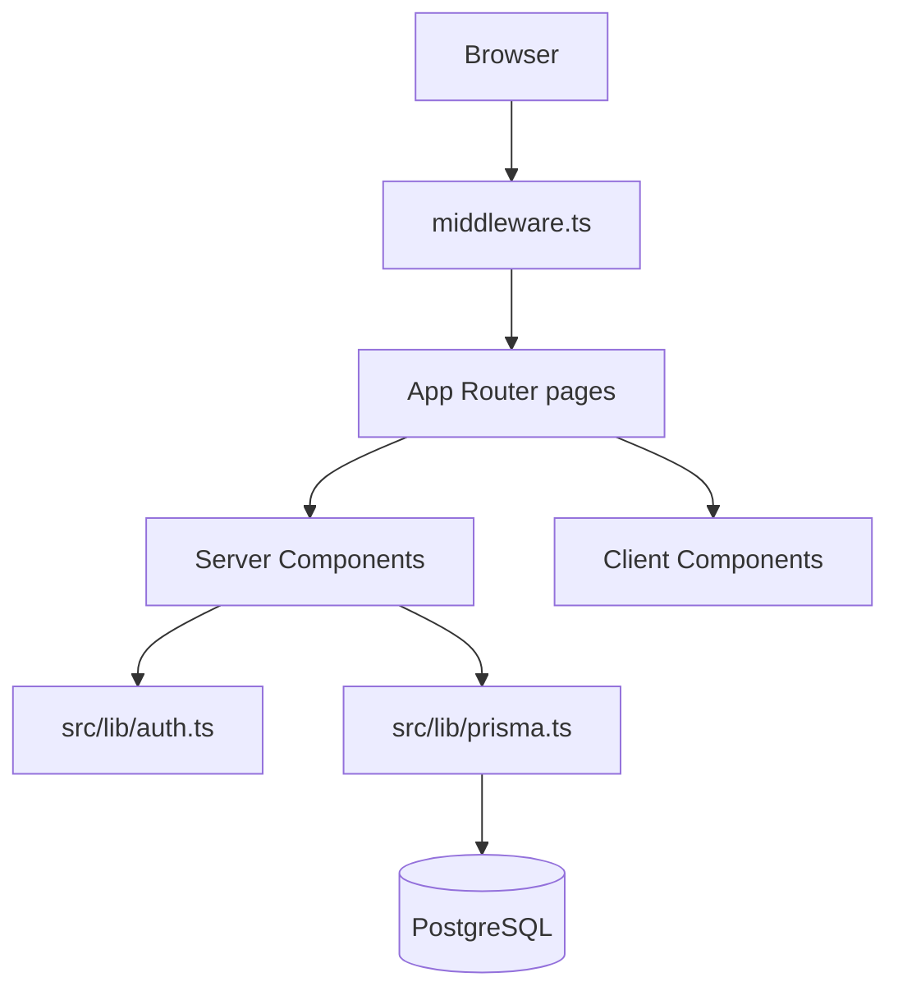

# Example: Next.js Web Application

This example shows onboarding outputs for a fictional **Acme Dashboard** — a Next.js App Router application with authentication and a PostgreSQL backend via Prisma.

Tool-agnostic: usable by Cursor, Claude Code, Aider, Cline, or any agent with file and git access.

---

## Fictional Project Snapshot

```text
acme-dashboard/
├── README.md
├── package.json
├── next.config.ts
├── prisma/
│   └── schema.prisma
├── src/
│   ├── app/
│   │   ├── layout.tsx
│   │   ├── page.tsx
│   │   ├── (auth)/
│   │   │   ├── login/page.tsx
│   │   │   └── register/page.tsx
│   │   └── (dashboard)/
│   │       ├── layout.tsx
│   │       └── projects/page.tsx
│   ├── components/
│   │   └── ui/
│   ├── lib/
│   │   ├── auth.ts
│   │   └── prisma.ts
│   └── middleware.ts
├── tests/
│   └── e2e/
│       └── login.spec.ts
└── .github/workflows/ci.yml
```

---

## Phase 1: Context Sources (sample output)

| Priority | File | Summary |
| -------- | ---- | ------- |
| 1 | `README.md` | Setup, env vars, `pnpm dev` |
| 2 | `prisma/schema.prisma` | User, Project, Membership models |
| 3 | `src/middleware.ts` | Route protection for `/dashboard` |
| 4 | `.github/workflows/ci.yml` | Lint, typecheck, Playwright e2e |
| 5 | `next.config.ts` | Image domains, experimental flags |

---

## Sample: AI_PROJECT_CONTEXT_REPORT.md (excerpt)

### Project Overview

**Key Facts**

- [Fact] Next.js 15 App Router with TypeScript. — Evidence: `package.json` (`"next": "^15.0.0"`), `src/app/` directory structure
- [Fact] Authentication via NextAuth (Auth.js). — Evidence: `package.json` dependency `"next-auth"`, `src/lib/auth.ts`
- [Fact] Database ORM is Prisma with PostgreSQL. — Evidence: `prisma/schema.prisma` (`provider = "postgresql"`), `src/lib/prisma.ts`
- [Fact] E2E tests use Playwright. — Evidence: `tests/e2e/login.spec.ts`, CI workflow step `pnpm exec playwright test`

**Assumptions**

- [Assumption] Production deploys to Vercel.
  Rationale: `vercel.json` not present, but README mentions Vercel and `next.config.ts` has standard Vercel-friendly settings. Confirm with team.

### Architecture Summary



| Module | Path | Responsibility |
| ------ | ---- | -------------- |
| Routes | `src/app/` | Pages, layouts, route groups |
| Auth | `src/lib/auth.ts` | Session, providers, callbacks |
| DB | `src/lib/prisma.ts` | Singleton Prisma client |
| UI | `src/components/ui/` | Shared UI primitives |
| Protection | `src/middleware.ts` | Redirect unauthenticated users |

### Engineering Conventions

- **Route groups:** `(auth)` and `(dashboard)` separate layouts without affecting URL — Evidence: `src/app/(dashboard)/layout.tsx`
- **Server vs client:** `"use client"` only on interactive components — Evidence: grep shows client directive in form components only
- **Data fetching:** Server Components fetch directly via Prisma; no REST layer for internal pages — Evidence: `src/app/(dashboard)/projects/page.tsx`
- **Styling:** Tailwind CSS with `cn()` utility — Evidence: `tailwind.config.ts`, `src/lib/utils.ts`

### Current Work In Progress

| Item | Location | Signal |
| ---- | -------- | ------ |
| Project invite flow | `src/app/(dashboard)/projects/page.tsx:45` | `// WIP: invite modal` |
| OAuth provider | `src/lib/auth.ts:28` | `// TODO: enable GitHub provider` |
| Feature flag | `next.config.ts:8` | `experimental.serverActions.bodySizeLimit` |

### Known Risks

| Zone | Why risky | Verification |
| ---- | --------- | ------------ |
| `src/lib/auth.ts` | Session callbacks affect all protected routes | E2e login test + manual session check |
| `src/middleware.ts` | Matcher config can accidentally expose routes | Review `config.matcher`; test unauthenticated access |
| `prisma/schema.prisma` | Migrations affect production data | Run `prisma migrate dev` locally; never edit applied migrations |
| Server Actions | CSRF/body size limits | Check `next.config.ts` experimental settings |

### Development History (recent)

| Date | Change | Evidence |
| ---- | ------ | -------- |
| 2026-06-12 | Added dashboard route group | Commit `feat/dashboard-layout` |
| 2026-06-08 | Migrated from Pages Router (partial) | Commit `refactor/app-router`, 14 files changed |
| 2026-06-01 | Added Playwright CI | Commit `ci/e2e-playwright` |

### Recommended Workflow

```bash
pnpm install
cp .env.example .env.local   # fill DATABASE_URL, NEXTAUTH_SECRET
pnpm prisma migrate dev
pnpm dev                     # http://localhost:3000
pnpm lint && pnpm typecheck
pnpm exec playwright test
```

---

## Sample: AI_PROJECT_MEMORY.md (full)

```markdown
# AI Project Memory

**Last updated:** 2026-06-16

## What This Project Is

Acme Dashboard — Next.js 15 App Router admin UI for managing projects. Auth via NextAuth, data via Prisma/PostgreSQL.

## Stack at a Glance

- **Framework:** Next.js 15 (App Router)
- **Language:** TypeScript
- **Database:** PostgreSQL + Prisma
- **Auth:** NextAuth (Auth.js)
- **Styling:** Tailwind CSS
- **E2E:** Playwright

## Structure

- `src/app/(auth)/` — login, register (public)
- `src/app/(dashboard)/` — protected pages
- `src/lib/auth.ts` — auth config (high risk)
- `src/lib/prisma.ts` — DB client singleton
- `src/middleware.ts` — route protection (high risk)
- `prisma/schema.prisma` — data model

## Critical Decisions

- App Router (not Pages Router) — migration in progress
- Server Components fetch data directly (no internal REST API)
- Route groups for layout separation

## Conventions (Easy to Violate)

- Put `"use client"` only where needed (forms, hooks)
- Use `src/components/ui/` for shared UI, not inline in pages
- Auth changes must update middleware matcher if routes change
- Never edit applied Prisma migrations

## Common Pitfalls

- Forgetting `NEXTAUTH_URL` in `.env.local` breaks auth locally
- Creating Prisma client per request (use singleton in `lib/prisma.ts`)
- Adding dashboard routes outside `(dashboard)` group skips layout

## Active Development

- Project invite flow (WIP)
- GitHub OAuth provider (TODO)

## When Touching X, Also Check Y

| If you change... | Also verify... |
| ---------------- | -------------- |
| `auth.ts` | `middleware.ts`, e2e login test |
| `schema.prisma` | run migrate, update seed if exists |
| New protected route | middleware matcher, dashboard layout |
| Server Action | body size limit in `next.config.ts` |

## High-Risk Zones

- `src/lib/auth.ts`
- `src/middleware.ts`
- `prisma/migrations/`

## Verification Checklist

pnpm install
pnpm prisma migrate dev
pnpm dev
pnpm lint && pnpm typecheck
pnpm exec playwright test
```

---

## Next.js-Specific Discovery Checklist

When onboarding a Next.js project, prioritize:

| File / Path | Why |
| ----------- | --- |
| `next.config.ts` / `next.config.js` | Rewrites, redirects, experimental flags |
| `src/middleware.ts` | Auth boundaries |
| `src/app/` layout hierarchy | Route groups, server vs client split |
| `prisma/schema.prisma` or ORM config | Data model |
| `.env.example` | Required secrets |
| `package.json` scripts | Dev, build, test commands |
| `.github/workflows/` | CI expectations |

---

## What This Example Teaches

1. **Web apps have boundary files** — middleware and auth config are high-risk and should be flagged early.
2. **Framework conventions matter** — App Router patterns (route groups, server components) should be documented with file evidence.
3. **Verification is stack-specific** — include `typecheck`, `playwright test`, and Prisma migrate commands.
4. **Stay tool-agnostic** — no Cursor- or Claude-specific instructions in the outputs.

See also: [universal-example.md](./universal-example.md) for a backend-only reference.
